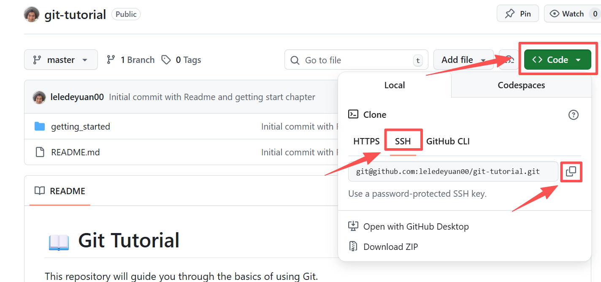

## 1. Introduction

:zap: Git is a really important tool for managing code and collaborating with others. 

It helps you keep track of changes :mag_right:, avoiding forget last modifications :x: , and makes teamwork much easier :open_hands:.

## 2. Installation

If you haven't installed Git yet, follow these steps:
- **Windows**: Download the installer from [git-scm.com](https://git-scm.com/download/win) and follow the installation instructions.
- **macOS**: You can install Git using Homebrew with the command `brew install git`, or download the installer from [git-scm.com](https://git-scm.com/download/mac).
- **Linux**: Use your distribution's package manager. For example, on Ubuntu, you can run `sudo apt-get install git`.

## 3. Configuring SSH Keys
To securely connect to GitHub, you need to set up SSH keys. Follow these steps:

1. Create a GitHub account if you don't have one: [GitHub](https://github.com/)
2. Open your terminal.
3. Generate a new SSH key pair by running:
   ``` bash
   ssh-keygen -t rsa -C "Your Email"
   ```
4. When prompted, press Enter to accept the default file location.
5. Copy the contents of your public key file.
   > Usually located at `~/.ssh/id_rsa.pub`
   > or C:\Users\YourUserName\\.ssh\id_rsa.pub on Windows

    ``` bash
    cat ~/.ssh/id_rsa.pub
    ```

    copy the output like `ssh-rsa AAAAB3NzaC1yc2EAAAABIwAAAQEAr... Email`

    
6. Go to your GitHub account settings, navigate to "SSH and GPG keys", and click "New SSH key". Paste your public key into the provided field and save it.
   
   - Go to GitHub Settings -> SSH and GPG keys -> New SSH key
    

    

   - Give your key a recognizable title, paste the key, and click "Add SSH key".
    
7. Test your SSH connection by running:
    ``` bash
    ssh -T git@github.com
    ```

    You should see a message like "Hi username! You've successfully authenticated...".

    

## 4. Cloning the Repository
Go to your forked repository on GitHub and copy the SSH URL.

In your terminal, navigate to the directory where you want to clone the repository and run:



``` bash
git clone YOUR_SSH_URL
```

:tada: Congratulations! You have successfully installed Git and configured your SSH keys to work with GitHub. Let's move on to the next section. :rocket: